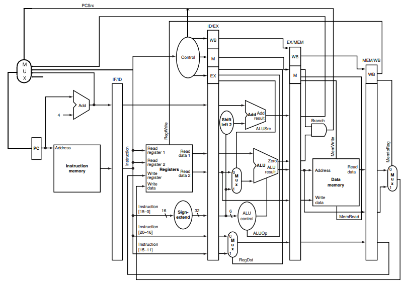

# MIPS Pipeline
Hugo Mendes, Leonardo Medeiros, Martim José, Sabrina Simão

## Diagrama de blocos do projeto

## Como utilizar
O nosso projeto utiliza os displays de 7 segmentos da placa para mostrar os valores dos 7 registradores, e o último segmento para mostrar em qual instrução está (sendo limitado até 15/F). O botão KEY0, é utilizado para avançar para próxima instrução (clock). O botão KEY1 é utilizado para resetar o PC, banco de registradores e LED. E por fim, o LEDG0 é utilizado para indicar que o programa tentou armazenar algo em um endereço que excedente (a última instrução).A baixo, pode-se visualizar o funcionamento do projeto:

https://www.youtube.com/watch?v=NN2UL7stdgA

Nos tópicos abaixo é possível ver as instruções que o progama roda e os valores que são utilizados pelas instruções.

## Programa implementado (Banco de Intruções - ROM)
| Instrução                                   | Detalhe da instrução          |
|---------------------------------------------|-------------------------------|
| 0 : 10001100000000100000000000000001;       | -- LW carrega 1 em R2         |
| 1 : 10001100000000010000000000000100;       | -- LW carrega 4 em R1         |
| 2 : 00000000000000000000000000000000;       | -- NOP                        |
| 3 : 00000000000000000000000000000000;       | -- NOP                        |
| 4 : 00000000000000000000000000000000;       | -- NOP                        |
| 5 : 00000000000000000000000000000000;       | -- NOP                        |
| 6 : 00010000001000100000000000001000;       | -- BEQ: R1 com R2 -> linha 14 |
| 7 : 00000000000000000000000000000000;       | -- NOP                        |
| 8 : 00000000000000000000000000000000;       | -- NOP                        |
| 9 : 00000000000000000000000000000000;       | -- NOP                        |
| 10: 00000000000000000000000000000000;       | -- NOP                        |
| 11: 00000000001000100010000000100010;       | -- SUB: R1 com R2 em R4       |
| 12: 00000000000000000000000000000000;       | -- NOP                        |
| 13: 00000000000000000000000000000000;       | -- NOP                        |
| 14: 00000000000000000000000000000000;       | -- NOP                        |
| 15: 00000000000000000000000000000000;       | -- NOP                        |
| 16: 00010000001000010000000000001000;       | -- BEQ: R1 com R1 -> linha 24 |
| 17: 00000000000000000000000000000000;       | -- NOP                        |
| 18: 00000000000000000000000000000000;       | -- NOP                        |
| 19: 00000000000000000000000000000000;       | -- NOP                        |
| 20: 00000000000000000000000000000000;       | -- NOP                        |
| 21: 00000000001000100001100000100000;       | -- SOMA: R1 com R2 em R3      |
| 22: 00000000000000000000000000000000;       | -- NOP                        |
| 23: 00000000000000000000000000000000;       | -- NOP                        |
| 24: 00000000000000000000000000000000;       | -- NOP                        |
| 25: 00000000000000000000000000000000;       | -- NOP                        |
| 26: 00000000000000000000000000000000;       | -- NOP                        |
| 27: 00000000010000010011100000101010;       | -- SLT: R1 com R2 em R7       |
| 28: 00000000001000100010100000100100;       | -- AND: R1 com R2 em R5       |
| 29: 00000000001000100011000000100101;       | -- OR: R1 com R2 em R6        |
| 30: 10101100000000010000011100000101;       | -- SW: MAIOR que 512          |
| 31: 00001000000000000000000000101000;       | -- JUMP: -> linha 40          |
| 33: 00000000000000000000000000000000;       | -- NOP                        |
| 34: 00000000001000100001100000100000;       | -- SOMA: R1 com R2 em R3      |
| [35..63]: 00000000000000000000000000000000; | -- Others                     |

## Memória RAM
| Valor salvo                                   |
|-----------------------------------------------|
| 0 : 00000000000000000000000000000000;         |
| 1 : 00000000000000000000000000000001;         |
| 2 : 00000000000000000000000000000010;         |
| 3 : 00000000000000000000000000000011;         |
| 4 : 00000000000000000000000000000100;         |
| 5 : 00000000000000000000000000001101;         |
| 6 : 00000000000000000000000000000110;         |
| 7 : 00000000000000000000000000000000;         |
| 8 : 00000000000000000000000000000000;         |
| 9 : 00000000000000000000000000000000;         |
| 10 : 00000000000000000000000000000000;        |
| [11..511] : 00000000000000000000000000000000; |

## Erros e Warnings

A compilação final do nosso projeto não indicou nenhum erro, porém obtivemos os seguintes warnings:

