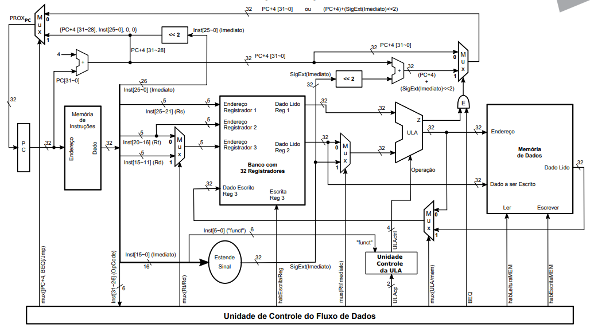
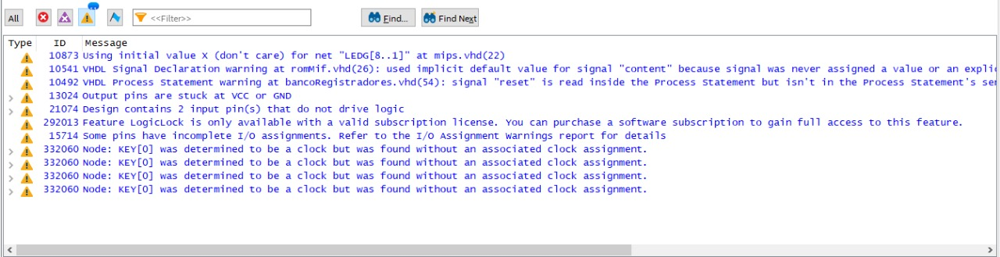

# MIPS Single Cycle
Hugo Mendes, Leonardo Medeiros, Martim José, Sabrina Simão

## Diagrama de blocos do projeto

## Como utilizar
O nosso projeto utiliza os displays de 7 segmentos da placa para mostrar os valores dos 7 registradores. O botão KEY0, é utilizado para avançar para próxima instrução (clock). O botão KEY1 é utilizado para resetar o PC, banco de registradores e LED. E por fim, o LEDG0 é utilizado para indicar que o programa tentou armazenar algo em um endereço que excedente (a última instrução). A baixo, pode-se visualizar o funcionamento do projeto:

https://www.youtube.com/watch?v=L-Grf2-ksCI

Nos tópicos abaixo é possível ver as instruções que o progama roda e os valores que são utilizados pelas instruções.

## Programa implementado (Banco de Intruções - ROM)
| Instrução                                   | Tipo de Instrução      | Detalhes        |
|---------------------------------------------|------------------------|-----------------|
| 0 : 10001100000000100000000000000001;       | -- LW                  |                 |
| 1 : 10001100000000010000000000000100;       | -- LW                  |                 |
| 2 : 00000000001000100001100000100000;       | -- SOMA                | R1 com R2 em R3 |
| 3 : 00000000001000100010000000100010;       | -- SUB                 | R1 com R2 em R4 |
| 4 : 00000000001000100010100000100100;       | -- AND                 | R1 com R2 em R5 |
| 5 : 00000000001000100011000000100101;       | -- OR                  | R1 com R2 em R6 |
| 6 : 00000000010000010011100000101010;       | -- SLT                 | R1 com R2 em R7 |
| 7 : 00010000011001000000000000000001;       | -- BEQ                 | R3 com R4       |
| 8 : 00010000100001000000000000000001;       | -- BEQ                 | R4 com R4       |
| 9 : 00001000000000000000000000001011;       | -- JUMP                | -> 11           |
| 10: 00001000000000000000000000001001;       | -- JUMP                | -> 9            |
| 11: 10101100000000110000000000000101;       | -- SW                  |                 |
| 12: 10001100000001010000000000000101;       | -- LW                  |                 |
| 13: 10101100000000110000011100000101;       | -- SW de mais que 512  |                 |
| [14..63]: 00000000000000000000000000000000; | -- Others              |                 |

## Memória RAM
| Valor salvo                                   |
|-----------------------------------------------|
| 0 : 00000000000000000000000000000000;         |
| 1 : 00000000000000000000000000000001;         |
| 2 : 00000000000000000000000000000010;         |
| 3 : 00000000000000000000000000000011;         |
| 4 : 00000000000000000000000000000100;         |
| 5 : 00000000000000000000000000001101;         |
| 6 : 00000000000000000000000000000110;         |
| 7 : 00000000000000000000000000000000;         |
| 8 : 00000000000000000000000000000000;         |
| 9 : 00000000000000000000000000000000;         |
| 10 : 00000000000000000000000000000000;        |
| [11..511] : 00000000000000000000000000000000; |

## Erros e Warnings

A compilação final do nosso projeto não indicou nenhum erro, porém obtivemos os seguintes warnings:

